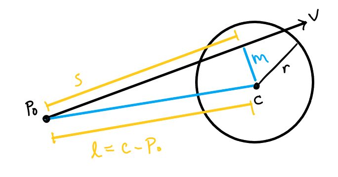

# PlanetarySystemViewer

## Sumamry

This repository launches an interactive, 3D model of a planetary system displayed in space created with a skybox. The model can be moved by dragging the mouse and zoomed in or out on using the mouse scroll. The model can be randomized with the r key or returned to the default with the n key. You can click on a planet to view it closer and return with the space key.

This project includes unique textures, unique normal maps, and unique cube maps stored in the texture folder. It features a single star, a particle trail that tracks each planet's orbit, and displays rocky and gas planets differently.


## How to build

*Windows*

Open git bash to the directory containing this repository.

```
mesh-viewer $ mkdir build
mesh-viewer $ cd build
mesh-viewer/build $ cmake ..
mesh-viewer/build $ start Viewer.sln
```

Run from the git bash command shell, 

```
mesh-viewer/build $ ../bin/Debug/Viewer.exe
```

*macOS*

Open terminal to the directory containing this repository.

```
mesh-viewer $ mkdir build
mesh-viewer $ cd build
mesh-viewer/build $ cmake ..
mesh-viewer/build $ make
```

To run each program from build, you would type

```
PlanetarySystemViewer/build $ ../bin/Viewer
```

## Controls

 - Use the scroll to zoom in or out
 - Click and drag the mouse around the screen to change the orientation
 - In the planetary view, click on a planet to navigate to it
 - Hit the space key to return to the planetary view
 - Press r to randomize the scene or the planet
 - Press n to return to the default scene


## Features

Background implemented with a unique cubemap.


Launch a viewer with orbiting planets.


Rotate and zoom abilities.


Unique textures, meshes, and normal maps.


Click on a planet to view it in more detail and return to the planetary model by clicking the space bar.


Phong shading in the main system and two unique shaders in the individual models.

Shaders for gas planets.


Shaders for rocky planets.


Particle system tracks orbits.


Randomize the planetary system by clicking r. Return to the default planetary system by clicking n.


## Data structures

### Models
This project uses a vector of Planet structs that contains orbit radius, as well as the size, velocity, and position of the planet. It also stores the texture and shader it uses (depending on the planet type), and a pointer to its particle trail (which consists of another vector). The particle trail stores the position, size, and alpha of a particle. In this instance, color, rotation, and velocity are meant to be kept consistent across particles and are thus stored as constants. Available shaders and textures are also stored as vectors. Uniform information for the shaders is stored in global structs. 

### Meshes
Meshes are stored as ply files and converted using a custom class (plymesh.cpp) that stores vertices (as separate face and position vectors for storage purposes), normals, and uvs in vectors. 


## Math and Algorithms

### Textures
This project begins with hand-drawn textures and cube maps.

### Normals
In this project, each texture has an accompanying normal map. First, I created a depth map by modifying a grayscale version of the texture. Creating a normal map from a depth map uses a kernel that goes through each pixel in the depth map to calculate the corresponding normal map pixel based on how it compares to its surrounding pixels. This data is stored as a color in a normal map and used a direction in a shader. For this project I used the online tool linked in the Resources and References section at the bottom. The use of this is expanded upon in the shader section. 

### Shaders
#### Flat (unlit.vs and unlit.fs)
The shader used for the star is a flat shader that takes the position of each vertex, projects it from world coordinates to a 2x2x2 cube at the origin, rasterizes and stores the data in buffers and displays white to the screen unless there it something in front of it.

#### Phong (phong-texture.vs and phong-texture.fs)
The initial model (of the whole planetary system) uses the Phong shader for the planets. It takes the texture, uv map, and planet mesh (stored in the planet vector and in globals, respectively) and for each vertex in the mesh it uses the uv map to find the pixel in the texture image that it corresponds to. It then calculates how three different kinds of light impact the displayed color. The ambient light is calculated as the color of the texture multiplied by the scalars stored in the material and light structs. The diffuse light is the ambient light multiplied by the scalar of the dot product between the direction of the light and the surface normal of the mesh. The specular light is calculated by scaling the light color by the dot product of the viewing direction and the direction of the light reflected around the vertex normal. These are then added together and projected to the screen in the same was as the flat shader. 

#### Bumpmap
The bump map is very similar to the Phong texture shader, but it takes in and uses the normal maps. In the vertex shader, it uses the texture uv map to find the normal of the bump map at the vertex position. Instead of using the vertex normals like the above Phong shader, the bump map shaders use the normalized sum of the vertex normal and the normal map normal.

#### Mobile (gas.vs and gas.fs)
This shader is intended for gas planets, as the vertices of the mesh move randomly along the vertex normal. This uses the vertex shader to give an undulating appearance, but uses a similar fragment shader to the Phong texture.

### Modeling
#### Single Planets
Once a planet it clicked on, the information that a click intersected a planet and about which planet was his is updated in globals. Then the drawer gets information about that planet from the planet vector. It uses the bounding box of the mesh to translate it to the origin, and scale it to size. It then rotates it around the y axis according to the orbit velocity (meant to convey a feeling rather than accurate physics).

#### Planetary System
In the planetary system display a matrix stack is used to translate and scale all the meshes. Then the star is scaled to its sized and the matrix used to do that it popped from the matrix. Then a series of matrices and pushed and popped for each planet in the planet vector. Within this loop particles are assigned a position, but they are only displayed after all the matrices are popped from the stack. This way, the particles correctly align with the orbit of their planet. 

#### Randomization
There is a default planetary system, but it can be randomized. A number of orbits is randomized between the size of the star and the max orbit (all of which is set in constants). The size corresponding to each orbit is randomized as well as the texture. Larger orbits are slower, and larger sizes are assigned the gas shader.

#### Camera Movement
The camera position is updated frame by frame when the user scrolls or drags the mouse across the screen according to the below algorithm.

```
x = radius * sin(azimuth) * cos(elevation)
y = radius * sin(elevation)
z = radius * cos(azimuth) * cos(elevation)
camera position = (x, y, z)
```

The azimuth is controlled by the change in x position of the mouse, the elevation by the change in y and the radius in the direction and magnitude of scrolling.

### Cube Maps
Cube maps take in 6 images and uses a shader to display them on the inside of 6 planes that are rendered at a specified distance from the origin. The cube maps in this project are handled by the renderer.cpp class.

### Particles
The particles are initialized without opacity (so that they are not visible until the planets beign to move). Each planet gets its own particle object pool. Meaning that as the particles fade from view the memory they took is repurposed for the new particles. This is usually done to preserve space in large particle systems, however the default settings of the program only gives each planet ten particles. Every tenth of a second, one (no longer visible) particle from each of the planet’s trail is updated to the current position and with full size and opacity. Every other particle in the trail fades and shrinks. 

### Clicking
The clicking mechanism is simplified from Real-Time Rendering cited in the Resources and Referenced section at the bottom. To tell if a ray intersects a sphere requires the starting position of the ray (vec3 P¬0), the direction of the ray (vec3 v), the position of the center of the sphere (vec3 c) and the radius of the sphere (float r). The former two are calculated in Viewer.cpp and the latter is stored in the Planet vector.



My program uses r + 0.5 as the radius. This gives small and/or fast planets a useful buffer for the viewer. The algorithm calculates the vector from the ray starting position to the center of the sphere. It then projects this vector onto the ray, giving us the length of s, as well as the length of 2 sides of a right triangle. This allows us to calculate m, the closes distance from the center of the sphere to the ray. If m is less than the radius, the sphere is intersected. There are more sophisticated algorithms covered in the reference list that allow you to determine the angle the ray hits the sphere as well as determine which sphere side of the sphere was intersected first (if the ray intersects more than one point). My program does not use these. 
The direction of the ray is calculated by taking the x and y of the mouse position when the click occurred, remapping them to [-1,1], and multiplying it by the inverse of the view and projection matrices to get it into world coordinates. The starting position of the ray is assumed to be the remapped x and y coordinates with the z coordinate of the near projection plane. The matrices and z coordinate are stored in the agl/renderer.cpp class.


### Potential Improvements
 - The clicking mechanism should use the distance of the intersection to determine which planet was clicked. 
 - The textures and normal could be better designed to hide the seam. 
 - More textures could be offered.
 - Multiple sky maps could be scrolled through. 
 - The mobile vertex shader could account for the seem when moving. Vertices on each end should move together, which should be able to be calculated using the uv mapping.
 - The algorithm used to randomize the planets is very loosely based on physics, but could be made much better.
 - Non-flat orbits could be used.
 - Moons, rings, and perhaps water should be integrated on the planets surface.


 

## Resources and References

http://staff.ustc.edu.cn/~zhuang/hpg/books/Packtpub.OpenGL.4.0.Shading.Language.Cookbook.Jul.2011.pdf 


*Free online tool that converts depth maps to normal maps:*

https://cpetry.github.io/NormalMap-Online/


*The bump map vertex and fragment shaders are modified from:*

https://github.com/alinen/agl/blob/main/shaders/bumpmap.vs 

https://github.com/alinen/agl/blob/main/shaders/bumpmap.fs


*The intersection test was created using:*

https://www.lighthouse3d.com/tutorials/maths/ray-sphere-intersection/

Möller Tomas, et al. “Chapter 22 Intersection Test Methods.” Real-Time Rendering, Fourth ed., CRC Press, 2019, pp. 957–959. 
